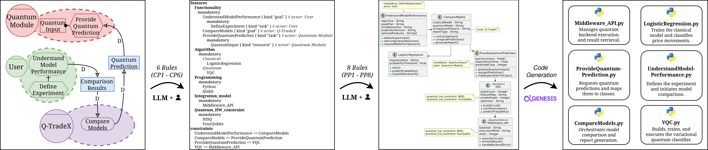

<h1 align="center"><em>QuARC: Q-TradeX Case Study</em></h1>

This repository documents the application of **QuARC** to the **Q-TradeX case study**, bringing together the models, semi-automatic transformations, incorporated decisions, and artifacts obtained at each level.

> [!NOTE]
> This repository complements the article *“QuARC: LLM-Aided Architecture-Centric Development of Hybrid Quantum Software”* by providing detailed information about the Q-TradeX case study and its application through QuARC.

## Table of Contents

* [Case Study: Q-TradeX](#case-study-q-tradex)
* [Application of QuARC](#application-of-quarc)
* [Case Documentation](#case-documentation)

## Case Study: Q-TradeX

Q-TradeX is a system designed to conduct a comparative experiment between classical *machine learning* approaches and hybrid quantum–classical models for the binary classification of BTC/USDT price movements.

> Binary price classification seeks to determine whether BTC will **rise** or **fall** over a given period, without predicting its exact value.

The **BTC/USDT** pair represents the exchange between two digital currencies:

* **Bitcoin (`BTC`):** a currency whose price varies in the market.
* **Tether (`USDT`):** a digital currency with a value close to one US dollar, used as a reference to express the price of one BTC.

Here, the BTC/USDT value indicates how many units of USDT are required to obtain one BTC.

Q-TradeX aims to generate empirical evidence regarding the behavior of a hybrid *Quantum Machine Learning* approach applied to the financial domain. For this purpose, a Variational Quantum Classifier (VQC) is compared with classical models under controlled and reproducible conditions, allowing the identification of advantages, limitations, or similarities between both approaches.

## Application of QuARC

**QuARC** is an LLM-aided, architecture-centric method for hybrid quantum–classical software development. Following the principles of Model-Driven Engineering (MDE), it organizes the process through progressive transformations between requirements, variability decisions, software architecture, and code artifacts.

  

* **Requirements:** modeling of the goals, responsibilities, and dependencies of the agents that comprise the system and its environment using the iStar 2.0 language.

* **Variability and architecture:** representation in UVL of the decisions required to configure a hybrid quantum–classical solution through an extended feature model for HQC systems, followed by the generation and refinement of a class diagram in PlantUML.

* **Code:** generation of Python and Qiskit code aligned with the classes, methods, attributes, and relationships defined in the class diagram through the GENESIS system.

The transition from the CIM to the PIM is supported by deterministic transformation rules that transform the modeling elements of one level into an output artifact, which is refined through the interaction between a user and an LLM. The transition from the PIM to the PSM is performed through GENESIS, which takes the class diagram generated in the PIM as input to generate source code.

## Case Documentation

Detailed information about the models, transformations, and artifacts obtained during the application of the case study in QuARC is available in the following documents:

* [CIM: goal-oriented modeling](docs/cim.md)
* [Transformation from CIM to PIM](docs/transformations/cim-to-pim.md)
* [PIM: variability and structural design](docs/pim.md)
* [Transformation from UVL to UML](docs/transformations/uvl-to-uml.md)
* [PSM: generated code](docs/psm.md)
* [Generated source code](src/)
