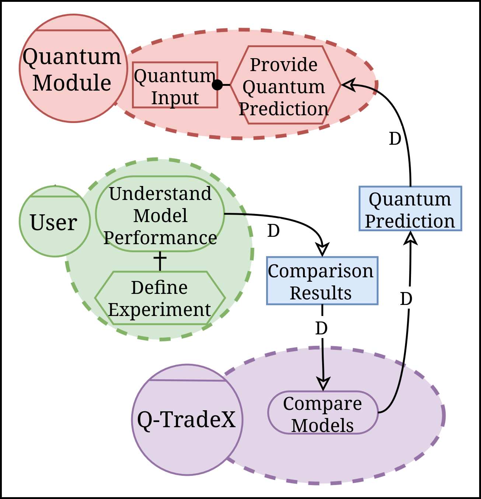

<h1 align="center"><em>Computation-Independent Model (CIM)</em></h1>

The **CIM** represents the actors within the system environment and their intentions. At this level, the actors, goals, tasks, resources, quality criteria, and dependencies of the case study are modeled.

The purpose of this level is to:

* Capture and describe the **goals, needs, and intentions** of each actor.
* Model the **rationale of the actors**.

For this purpose, a **Goal-Oriented Requirements Engineering (GORE)** approach is applied through the sociotechnical modeling language *iStar 2.0*, which enables the representation of the relationships between actors and the intentional elements involved.

  

> [!IMPORTANT]
> The generated model was intentionally kept limited because its purpose is to serve as the input to the application flow of the *pipeline* proposed in QuARC, rather than to provide a complete requirements analysis.

## Model Description

### Main Actors

The model represents three main actors:

* **User:** aims to understand the performance of the models (*Understand Model Performance*) and, for this purpose, defines the conditions under which the experiment will be executed through the task *Define Experiment*.

* **Q-TradeX:** aims to compare the two approaches through the task *Compare Models* and provide the comparison results (*Comparison Results*) to the user.

* **Quantum Module:** aims to provide the quantum prediction through the task *Provide Quantum Prediction*, using the quantum input (*Quantum Input*) as a resource.

### Social Dependencies

The social dependencies represented in the model establish that:

* **User** depends on **Q-TradeX** to obtain the comparison results.

* **Q-TradeX** depends on **Quantum Module** to obtain the quantum prediction required during the model comparison.

Thus the model captures the rationale of the case study: the user seeks to understand the performance of the evaluated approaches, Q-TradeX performs their comparison, and the quantum module provides the prediction required by the hybrid quantum–classical approach.
