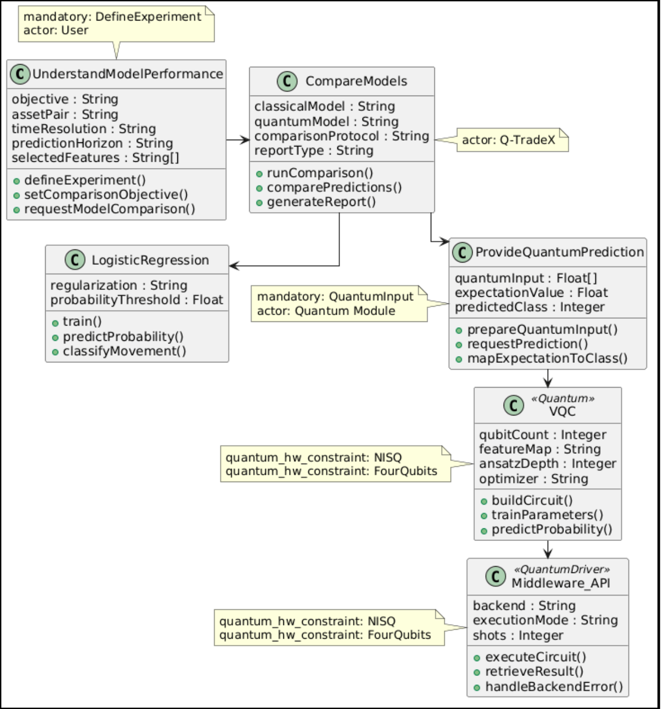

<h1 align="center"><em>Platform-Independent Model (PIM)</em></h1>

The **PIM** represents the **structure** and **behavior** of the system without coupling it to a concrete implementation, technology, or specific platform.

The purpose of this level is to incorporate, based on the goal model developed under the **GORE** approach, the design decisions associated with the structure and behavior of the system. Here:

* **Structure:** technological aspects, such as programming languages and integration methods between nodes.

* **Behavior:** main functionalities derived from the goal model.

In QuARC, this level uses an **extended feature model for hybrid quantum–classical systems** as the basis for developing a feature model for the case study and a **class diagram** generated from the decisions represented in that model.

> [!NOTE]
> QuARC uses feature models originating from the discipline of *Software Product Lines (SPL)*, which has the **explicit management of variability** within a product line as one of its main pillars.
>
> In the context of quantum software engineering, variability considers aspects such as:
>
> * High technological fragmentation of the HQC ecosystem.
> * Number of decisions that must be evaluated.
>
> Through an SPL approach, it is possible to model:
>
> * Alternatives.
> * Dependencies.
> * Constraints.

Thus, the **extended feature model** organizes the variability of the HQC ecosystem through feature groups that address:

* Functionalities.
* Classical and quantum algorithms.
* Programming languages.
* Integration methods.
* Quantum hardware constraints.

The purpose of this level is to:

* Capture the decisions that must be considered when constructing Q-TradeX.
* Represent the options selected within each feature group.
* Model the overall structure and behavior of the system.
* Preserve the relationship with the goals, tasks, and resources defined in the CIM.

To achieve this, the variability model is expressed in the **Universal Variability Language (UVL)**, a textual language for defining feature models. Likewise, the class diagram is represented in **UML** using elements from the **Quantum-UML** profile.

> [!NOTE]
> Since UML does not provide native mechanisms for distinguishing classical components from quantum components, the **Quantum-UML** profile is used. This profile extends UML through stereotypes that enable the classification and representation of components in hybrid quantum–classical systems, such as `«Quantum»` and `«QuantumDriver»`.

## Model Description

### Variability Model in UVL

The variability model organizes the decisions of Q-TradeX through the groups defined in the **extended feature model for HQC systems**.

  

The main groups and features represented are:

* **`Functionality`:** brings together the goals, tasks, and resources derived from the CIM that express what the actors seek to achieve and the behavior that the system must provide. For each element, its type and associated actor are preserved. It includes `UnderstandModelPerformance`, `DefineExperiment`, `CompareModels`, `ProvideQuantumPrediction`, and `QuantumInput`.

> [!NOTE]
> Unlike the other groups, these elements do not yet constitute **structural or technological decisions**, such as the programming language or integration method, but instead preserve the **original rationale of the actors**.

* **`Algorithm`:** defines the algorithms used to perform the comparison. The classical model corresponds to `LogisticRegression`, while the quantum approach uses a `VQC`.

* **`Programming`:** defines `Python` and `Qiskit` as the programming language and framework used for the code implementation.

* **`Integration_model`:** defines `Middleware_API` as the integration mechanism between the classical and quantum nodes.

* **`Quantum_HW_constraint`:** represents the `NISQ` and `FourQubits` hardware constraints associated with quantum execution.

The model also includes **constraints between features**, which relate features located in different groups and therefore express the dependencies required within the solution.

* `UnderstandModelPerformance` requires `CompareModels`, because understanding the performance of the approaches requires a comparison between them.

* `CompareModels` requires `ProvideQuantumPrediction`, because the comparison requires a prediction from the quantum approach.

* `ProvideQuantumPrediction` requires `VQC`, because the quantum prediction is obtained through the selected algorithm.

* `VQC` requires `Middleware_API`, because the execution of the quantum classifier requires an integration mechanism between components.

These constraints represent the logic required to fulfill the goals and functionalities defined in `Functionality`, considering their relationship with the **algorithm and integration-method decisions** required to achieve them.

### Class Diagram in PlantUML

> [!WARNING]
> The final class diagram is not obtained solely through automatic generation. To produce it, **deterministic transformation rules** are first applied to the UVL model, generating a preliminary diagram. This result is subsequently refined through a **semi-automatic process** that combines the assistance of an LLM with the decisions provided by the user.
>
> The complete process, including the automatically generated and refined diagrams, is documented in [Transformation within the PIM: from UVL to UML](transformations/uvl-to-uml.md).

  

The resulting diagram contains the following main classes:

* **`UnderstandModelPerformance`:** definition of the experiment and the conditions under which the comparison will be performed.

* **`CompareModels`:** coordinates the execution of the classical and quantum approaches, compares their predictions, and generates a report.

* **`LogisticRegression`:** classical model used to train, estimate probabilities, and classify the price movement.

* **`ProvideQuantumPrediction`:** prepares the quantum input, requests the prediction, and transforms the obtained value into a class.

* **`VQC`:** quantum classifier identified through the `«Quantum»` stereotype.

* **`Middleware_API`:** communication mechanism with the quantum execution environment, identified through the `«QuantumDriver»` stereotype.

The notes within the diagram address the need to preserve all information across the different levels, making it possible to identify the origin of each modeling element throughout the different stages of the *pipeline* and thereby establishing **vertical traceability** between modeling levels. The traceability elements include:

* Associated actors.
* Mandatory relationships.
* Quantum hardware constraints.
