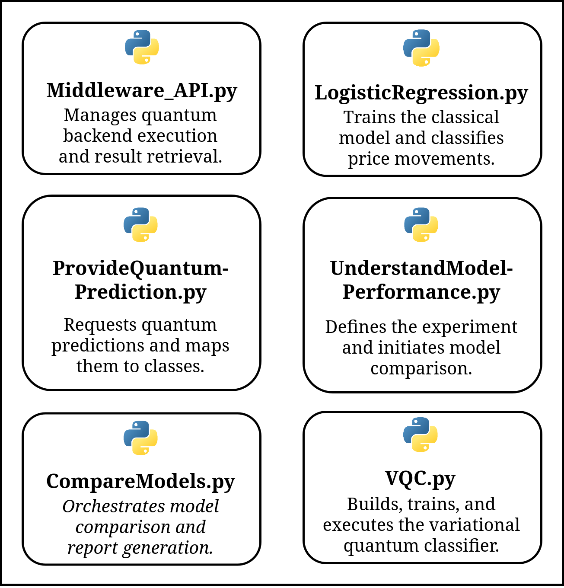
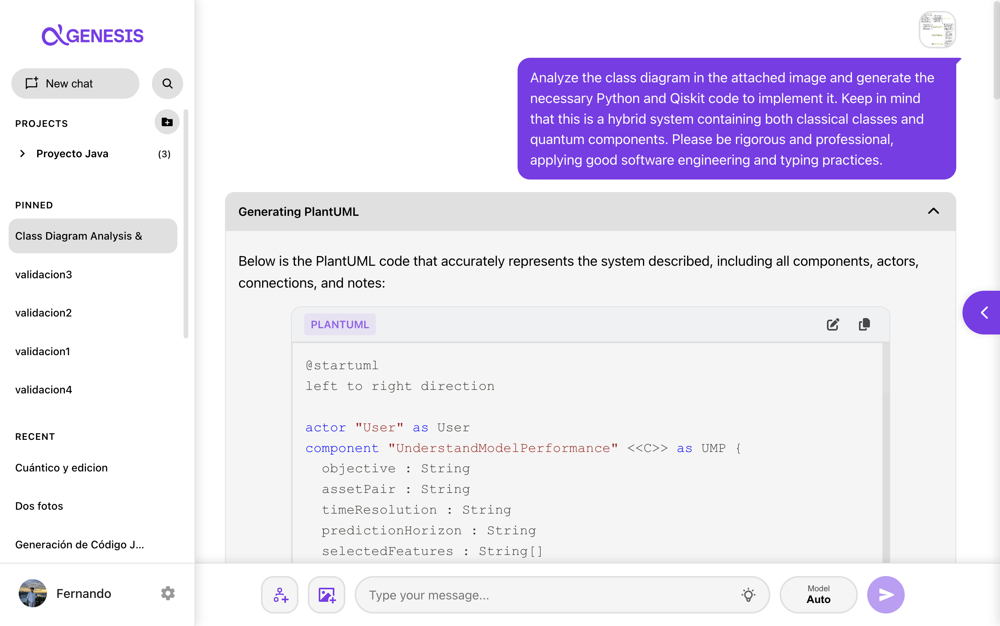
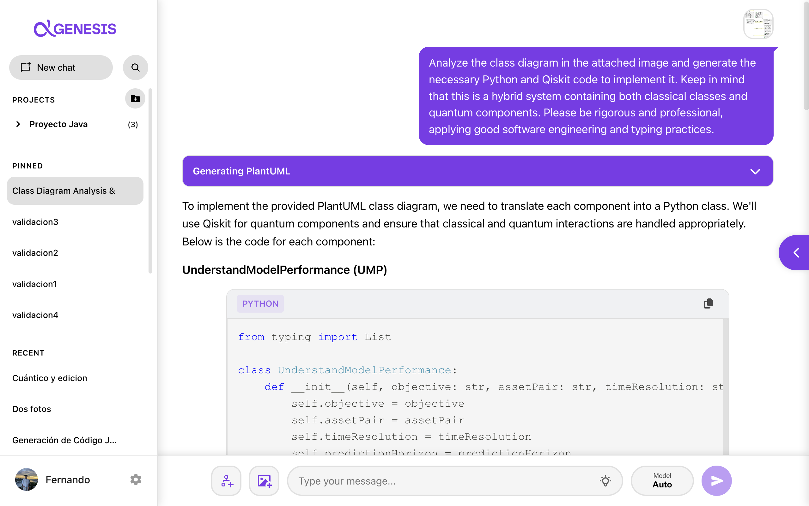
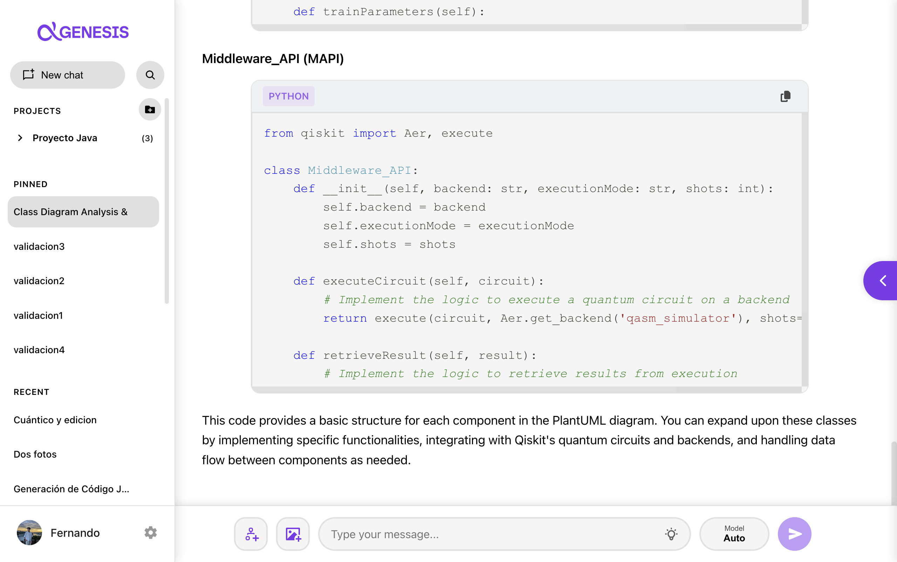
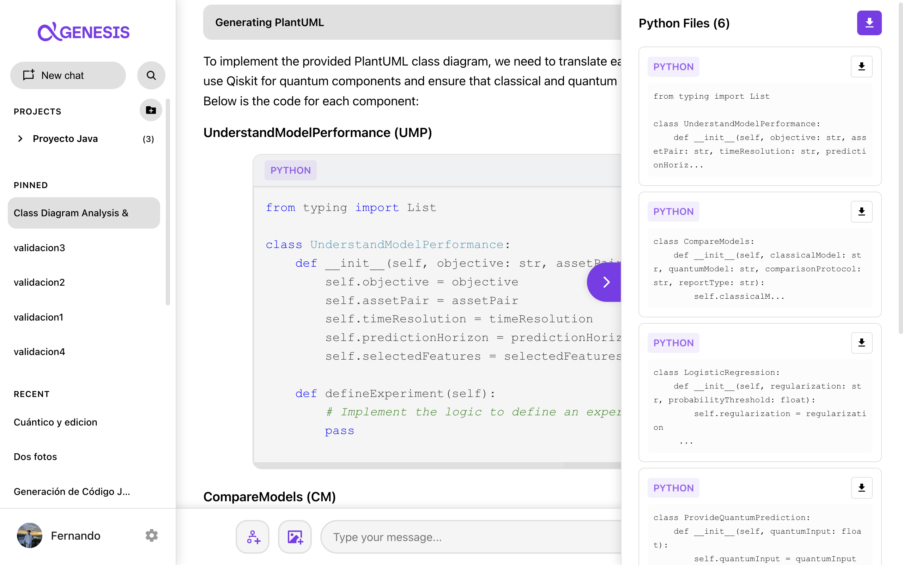
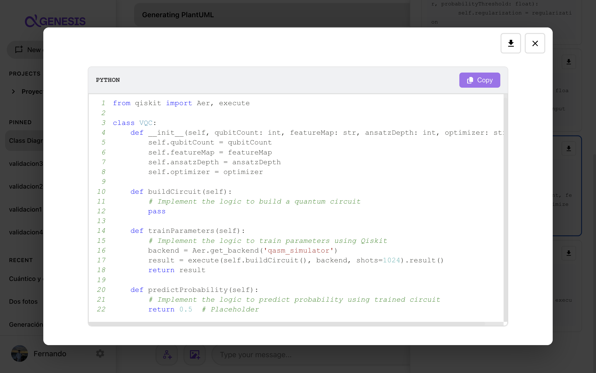

<h1 align="center"><em>Platform-Specific Model (PSM)</em></h1>

The **PSM** represents the case study applied to a specific platform or technology, where the decisions defined in the generated class diagram are transformed into concrete artifacts implemented using specific languages and libraries.

In QuARC, this level corresponds to the **source code generated from the class diagram refined in the PIM**, which is written in **Python** as the programming language and uses **Qiskit** as the framework for defining the quantum components.

The purpose of this level is to:

* Materialize the structure and behavior defined in the class diagram.
* Generate the classes, attributes, methods, and relationships represented in the PIM.
* Incorporate the interaction between classical and quantum components.
* Provide a code base for the subsequent implementation of the Q-TradeX logic.

## Code Generation Using GENESIS

The code is generated using **GENESIS**, a web application for the automatic generation of classical and quantum code through **generative artificial intelligence**.

GENESIS receives the class diagram generated during the PIM as input and generates the corresponding code using either a customized *prompt* or a previously defined *prompt* template together with the image of the diagram to be implemented. The generation process consists of:

1. **Model input:** the class diagram image is provided as input together with the generation *prompt*.

2. **Multimodal interpretation:** a multimodal model analyzes the image and identifies the classes, attributes, methods, relationships, notes, and stereotypes represented in the diagram.

3. **PlantUML generation:** GENESIS reconstructs a textual representation of the model, which can be reviewed and modified using its PlantUML editor.

4. **Code generation:** based on the interpreted model, Python and Qiskit code is produced for the classical and quantum components.

5. **File organization:** each class is presented in an independent file, enabling its review, editing, copying, or download.

## Generated Code

The files generated using GENESIS are available in the [`src/`](../src/) directory.

  

* **[`UnderstandModelPerformance.py`](../src/UnderstandModelPerformance.py):** defines the experiment and enables the comparison objective to be established and the model comparison to be requested.

* **[`CompareModels.py`](../src/CompareModels.py):** coordinates the comparison between the classical and quantum approaches, requests their predictions, and represents the generation of the report.

* **[`LogisticRegression.py`](../src/LogisticRegression.py):** contains the structure of the classical model used to train, estimate probabilities, and classify the price movement.

* **[`ProvideQuantumPrediction.py`](../src/ProvideQuantumPrediction.py):** prepares the quantum input, requests a prediction from the VQC, and transforms the result into a binary class.

* **[`VQC.py`](../src/VQC.py):** represents the quantum classifier and includes the operations required to construct the circuit, train its parameters, and generate predictions.

* **[`Middleware_API.py`](../src/Middleware_API.py):** represents the integration mechanism with the quantum environment, enabling circuit execution and result retrieval.

The names of the classes, attributes, and methods remain aligned with those defined in the class diagram, thereby preserving **vertical traceability** between the models.

In this case, the generated code corresponds to a **structural implementation baseline** that preserves the classes, attributes, methods, and relationships defined in the class diagram. This code uses default values and comments indicating the logic that still needs to be implemented, serving as a structural and logical foundation for the user to subsequently develop the final implementation.

## Validation of the Generated Code

As an external analysis of the code generated by GENESIS, an evaluation was conducted to determine the fidelity of the code with respect to the elements defined in the class diagram. For this purpose, the results are classified as:

* **True positives (TP):** elements present in the diagram that were faithfully reproduced in the code.

* **False positives (FP):** elements generated incorrectly or arbitrarily by the model without any previous reference in the original design.

* **False negatives (FN):** elements omitted by the tool despite being part of the technical specification of the diagram.

The following results were obtained for Q-TradeX:

| Architectural element | TP | FP | FN |
| --------------------- | -: | -: | -: |
| Classes               |  6 |  0 |  0 |
| Relationships         |  3 |  0 |  2 |
| Methods               | 18 |  0 |  0 |
| Attributes            | 21 |  0 |  0 |
| Packages              |  0 |  0 |  0 |

Based on these values, the generated code obtained the following results for the evaluated performance metrics:

* **Weighted precision:** 100%.
* **Weighted recall:** 93.68%.
* **F1-Score:** 96.74%.

These results indicate that GENESIS did not incorporate elements that were absent from the diagram and reproduced most of its content. The identified differences correspond to two relationships that were not represented in the final code.

* [View the complete validation report](../artifacts/psm/genesis_quantitative_validation.pdf)

## GENESIS Execution

The following screenshots show the execution of the Q-TradeX code generation process using GENESIS.

<table>
  <tr>
    <td align="center" width="50%">
      
       
      PlantUML generation
    </td>
    <td align="center" width="50%">
      
       
      Beginning of code generation
    </td>
  </tr>
  <tr>
    <td align="center" width="50%">
      
       
      Completion of code generation
    </td>
    <td align="center" width="50%">
      
       
      Generated files
    </td>
  </tr>
  <tr>
    <td align="center" colspan="2">
      
       
      Generated VQC code
    </td>
  </tr>
</table>
