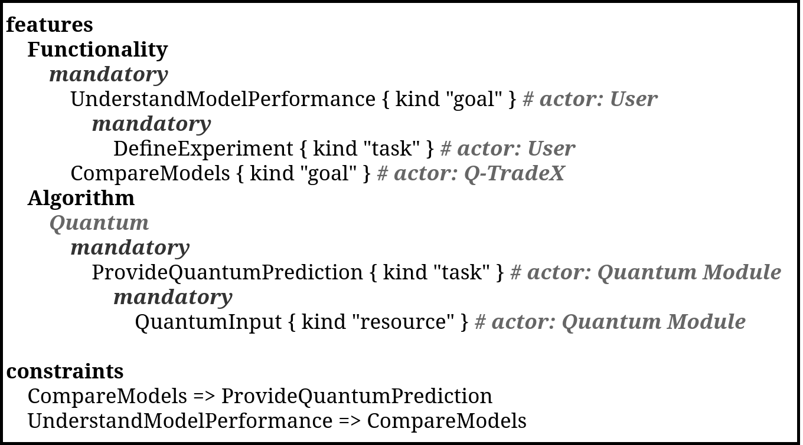
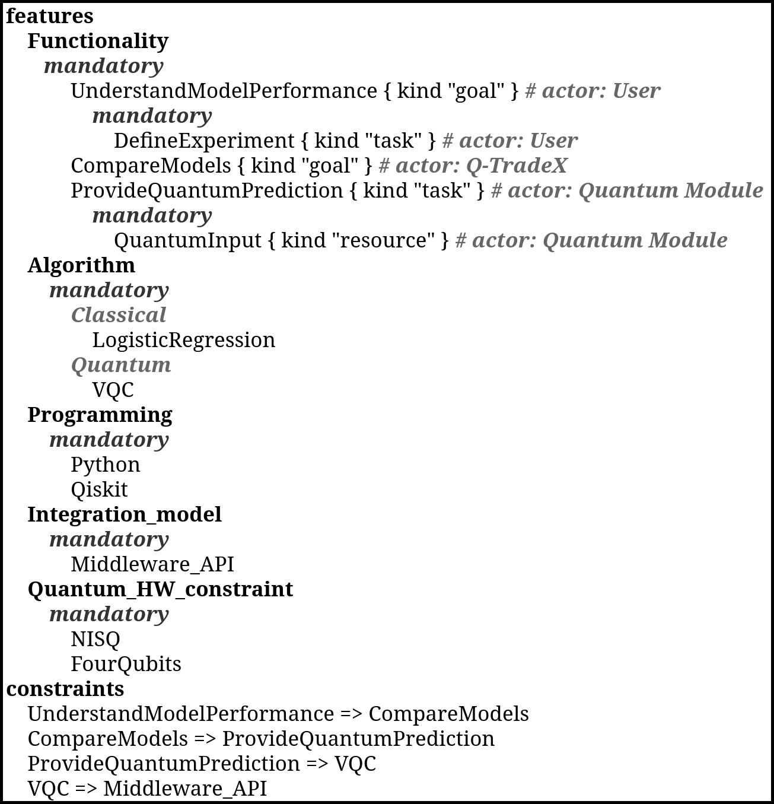

<h1 align="center"><em>Transformation from CIM to PIM</em></h1>

At this point, since the *GORE* model is oriented toward representing the goals and rationale of the actors, it can be observed that, for the most part, it does not include the structural and technological information required to complete the groups defined in the extended feature model for HQC systems.

In this context, the transformation from the CIM to the PIM begins with the application of deterministic transformation rules focused on converting the modeling elements of one level into their corresponding elements in the next level.

## Automatically Generated Artifact

The following UVL model is obtained by applying the transformation rules:

  

> [!WARNING]
> The current deterministic transformation rules are under development; therefore, they mainly focus on transforming elements from one modeling level into elements of the next level. For this reason, semantic aspects are not yet fully covered.
>
> For example, `ProvideQuantumPrediction` was placed within the `Algorithm` group because of the presence of the term `Quantum`. However, this element represents a task rather than an algorithm, so it should remain within `Functionality`.

Once the model has been generated, the absence of certain feature groups, such as `Programming`, `Integration_model`, and `Quantum_HW_constraint`, becomes evident, as does the lack of a correct specification of the classical and quantum algorithms.

> [!TIP]
> In this context, the completeness of the GORE model directly influences the quality of the generated UVL, since a model with a higher level of detail and coverage makes it possible to generate a solution with a greater number of features.

Likewise, the need to interpret the semantics of the model arises. For this reason, the LLM acts as a tool capable of processing natural language, detecting ambiguities, and proposing solutions. This capability, combined with the user's judgment, enables a process in which the model is reviewed and completed.

Thus, considering the roles of the user and the LLM, once the initial artifact has been generated, a semi-automatic process is applied in which both review and refine the model. This process makes it possible to:

* Correct the placement of the generated features.
* Complete the groups not represented in the *iStar* model.
* Incorporate algorithmic, technological, integration, and quantum hardware decisions.
* Verify the consistency between the features and their constraints.

## Refined Model

As a result of the interaction between the user and the LLM, the final variability model used in the PIM is obtained:

  

