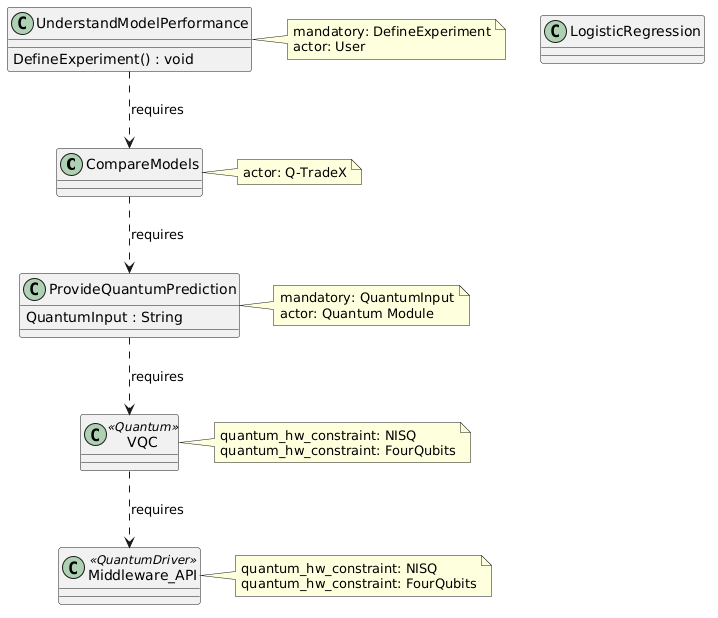

<h1 align="center"><em>Transformation within the PIM: from UVL to UML</em></h1>

Within the PIM, the variability model expressed in UVL is transformed, through the application of deterministic transformation rules, into a class diagram written in UML using the QuantumUML profile on the PlantUML platform.

## Automatically Generated Artifact

By applying the transformation rules, the following class diagram is obtained:

  

During this transformation:

* The selected features are converted into classes, methods, or attributes according to their type.
* The `requires` constraints are represented as relationships between classes.
* `VQC` and `Middleware_API` preserve the `«Quantum»` and `«QuantumDriver»` stereotypes.
* Actors, mandatory relationships, and hardware constraints are preserved through notes.
* Algorithmic and integration decisions are incorporated as structural components of the system.

Thus, the generated diagram remains vertically aligned with the UVL model, but its attributes, methods, and relationships are incomplete.

> [!NOTE]
> For example, some classes contain only their name, while others include general information that requires further specification. Likewise, the `LogisticRegression` class is isolated from the other classes.

In this context, based on the class diagram generated solely through the transformation rules, the user and the LLM complete the elements required to further specify the structure and behavior of Q-TradeX in aspects such as:

* Incorporation of attributes and methods into the generated classes.
* Specification of the responsibilities of each component.
* Definition of the elements required for the classical and quantum models.
* Adjustment of the relationships between classes.
* Preservation of the stereotypes, actors, and constraints derived from the UVL model.

## Refined Model

As a result of the refinement process, the following class diagram is obtained and used as the final PIM artifact:

  

